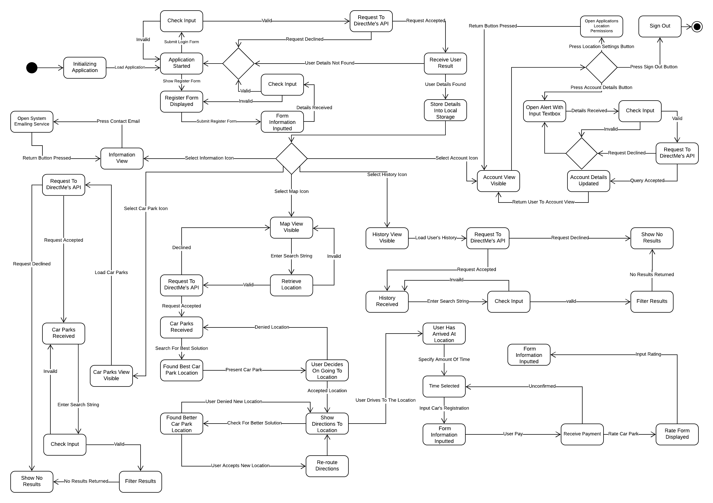

# DirectMe - Mobile Application

The focus behind this final year computing project is to make parking easier, and dynamic for the user. The idea works by using the external data that will be displayed in our application programming interface (API) which will be combined with the user’s information that has been specified previously in the application. This information will then be inserted into an algorithm that will determine what is the best location to park their vehicle within a radius of the postcode, geo-location, or street name given.

This component...

## Editors
* Martyn Fitzgerald - 16025948

## State Transition Diagram

This is a diagram that shows the key of the state transition.

<div align="center">

</div>

This is a diagram that shows how the system shall be used.

<div align="center">

</div>

## Software Used

* Node.js
* Visual Studio Code
* Expo CLI (Command Line Utility)
* Lucidchart

## Setup Environment (Windows)

1. If testing Android device, connect to the computer through a USB cable.
2. Install Git (https://gitforwindows.org/).
3. Install Node.js 12+ LTS (https://nodejs.org/en/download/).
4. Setup DirectMe API (https://gitlab.uwe.ac.uk/m4-fitzgerald/DirectMe-API).
5. Setup DirectMe Worker (https://gitlab.uwe.ac.uk/m4-fitzgerald/DirectMe-Worker).
6. Open Command Prompt.
7. Install Expo CLI.
```bash
npm install -g expo-cli
```

## Installation

1. Clone the git repository to your computer's workspace.
```bash
git clone https://gitlab.uwe.ac.uk/m4-fitzgerald/Parking-Application-Mobile-Prototype.git
```
2. Move into the folder of the repository.
```bash
cd Parking-Application-Mobile-Prototype
```
3. Install all dependencies.
```bash
npm install
```
4. Start the Expo CLI.
```bash
npm start -c
```
5. If, Expo CLI doesn't open automatically, open a internet browser and search 'localhost:19002'.
6. Once on the Expo CLI wait for console to output 'Tunnel ready'.
7. Select the option 'Local' on the type connection.
8. Press 'Run on Android device/emulator' or 'Run on IOS simulator'